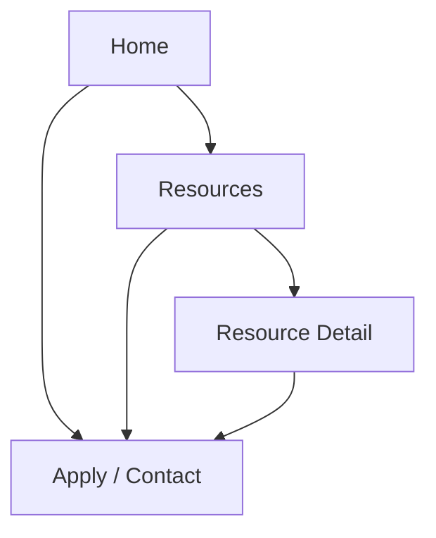

## 1. Product Overview
Redesign the Liveboost PH marketing site with a modern fintech aesthetic (inspired by pipe.com), emphasizing clear value propositions and strong CTAs.
Enable a simple markdown-based content workflow so non-engineering updates (insights/resources pages) can ship via content PRs.

## 2. Core Features

### 2.1 User Roles
| Role | Registration Method | Core Permissions |
|------|---------------------|------------------|
| Site Visitor | None | Browse pages, read resources, submit an application/contact form |
| Internal Editor (Git workflow) | Repo access (PRs) | Add/edit markdown content, images, and metadata for resources pages |

### 2.2 Feature Module
Our site requirements consist of the following main pages:
1. **Home**: modern hero/value proposition, trust proof, product narrative, and primary CTA.
2. **Resources**: markdown-driven list + detail pages for insights/content.
3. **Apply / Contact**: lead capture form with confirmation state.

### 2.3 Page Details
| Page Name | Module Name | Feature description |
|-----------|-------------|---------------------|
| Home | Top navigation | Navigate to Home/Resources/Apply; keep persistent primary CTA button |
| Home | Hero + primary CTA | Communicate main value prop; provide “Apply” / “Talk to us” CTA above the fold |
| Home | Value props | Explain 3–5 core benefits with concise copy and supporting visuals/icons |
| Home | Social proof | Display logos, key metrics, or testimonials to build trust |
| Home | How it works | Explain the process in 3–4 steps; link to Apply CTA |
| Home | Secondary CTA band | Reinforce value prop with repeated CTA near page bottom |
| Home | Footer | Provide key links, legal/company info, and contact email |
| Resources | Content index | List posts sourced from markdown; support basic filtering by tag/topic and search by title |
| Resources | Content detail | Render markdown (typography, code blocks if needed, images); show publish date, author (optional), tags; include CTA module at end |
| Resources | SEO metadata | Set per-post title/description/OG image from frontmatter |
| Apply / Contact | Lead form | Collect required fields (name, email, company) + optional context; validate; submit; prevent duplicates (soft) |
| Apply / Contact | Submission states | Show loading, success confirmation, and friendly error with retry |
| Apply / Contact | Tracking basics | Record source page/UTM params (if present) with the lead submission |

## 3. Core Process
**Visitor Flow**
1. You land on Home and immediately see the value proposition and primary CTA.
2. You either (a) proceed directly to Apply, or (b) explore Resources to build confidence.
3. You submit the lead form; you receive an on-page confirmation.

**Internal Editor Flow (markdown workflow)**
1. You add or edit a markdown file (with frontmatter) for a new resource post.
2. You open a PR; after merge, the site rebuilds and the Resources index/detail pages update.

