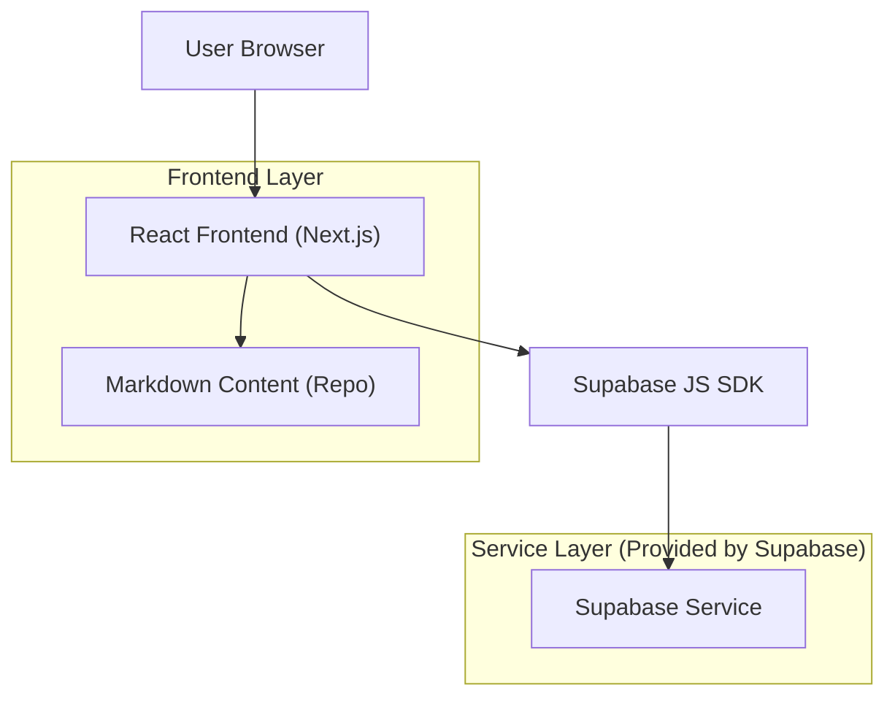
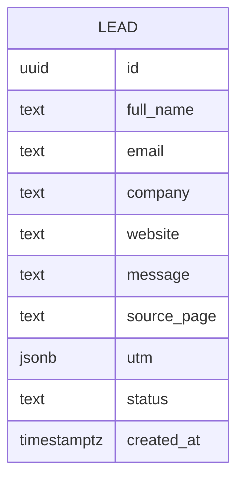

## 1.Architecture design


## 2.Technology Description
- Frontend: React@18 + Next.js (App Router) + TypeScript + tailwindcss@3
- Backend: None (direct Supabase integration from frontend)
- Data/Forms: Supabase (PostgreSQL) for lead submissions
- Content workflow: Markdown/MDX files in repo (frontmatter for metadata) rendered at build/runtime

## 3.Route definitions
| Route | Purpose |
|-------|---------|
| / | Home page with value props and primary CTA |
| /resources | Resources index (markdown-driven list + filtering/search) |
| /resources/[slug] | Resource detail rendered from markdown/MDX |
| /apply | Lead capture form + confirmation states |

## 6.Data model(if applicable)

### 6.1 Data model definition


### 6.2 Data Definition Language
Lead Table (leads)
```
-- create table
CREATE TABLE leads (
  id UUID PRIMARY KEY DEFAULT gen_random_uuid(),
  full_name TEXT NOT NULL,
  email TEXT NOT NULL,
  company TEXT NOT NULL,
  website TEXT,
  message TEXT,
  source_page TEXT,
  utm JSONB,
  status TEXT DEFAULT 'new' CHECK (status IN ('new','reviewed','contacted','closed')),
  created_at TIMESTAMPTZ NOT NULL DEFAULT NOW()
);

-- helpful index
CREATE INDEX idx_leads_created_at ON leads (created_at DESC);
CREATE INDEX idx_leads_email ON leads (email);

-- permissions (baseline guidance)
GRANT INSERT ON leads TO anon;
GRANT ALL PRIVILEGES ON leads TO authenticated;

-- row level security
ALTER TABLE leads ENABLE ROW LEVEL SECURITY;

-- allow public form submissions (insert only)
CREATE POLICY "leads_anon_insert" ON leads
  FOR INSERT TO anon
  WITH CHECK (true);

-- allow internal review in Supabase dashboard (authenticated)
CREATE POLICY "leads_auth_select" ON leads
  FOR SELECT TO authenticated
  USING (true);

CREATE POLICY "leads_auth_update" ON leads
  FOR UPDATE TO authenticated
  USING (true);
```

Markdown content structure (repo)
```
/content/resources/<slug>.md

---
title: "..."
description: "..."
date: "2026-01-01"
tags: ["funding", "growth"]
ogImage: "/og/<slug>.png"
---

# Post content...
```
